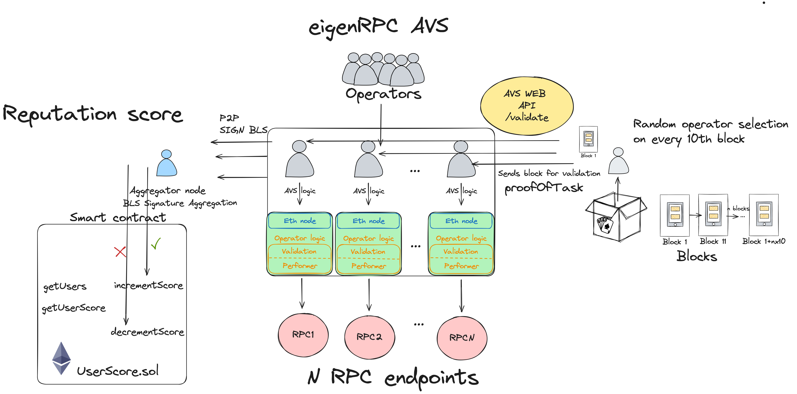

# 🔐 eigenRPC

## Introduction 🌐

Welcome to the eigenRPC project! This project leverages the power of Eigen Layer and Othentic Stack to create a robust and secure decentralized RPC network. By decentralizing the RPC, we help decentralize the blockchain space and provide a reliable connection to blockchain data, ensuring enhanced security, reliability, and trust in the network. 🌟

## How It Works 🔍

### Network Operators 🌟

Operators are the backbone of our network. Here's what they need to do:

1. **Join the Network**: Operators must run an Ethereum node.
2. **Run Logic**: They also need to implement Performer/Attestation operator logic.
3. **Expose Endpoints**: The Ethereum node exposes RPC endpoints.
4. **Validation**: Operators validate other operators' logic and results.

### Process Overview 🛠️

The decentralized RPC process follows a structured approach to ensure the accuracy and validity of the data:

1. **Operator Selection**: Every 10 blocks, a random operator is selected.
2. **Data Fetching**: The selected operator retrieves the latest block from their end.
3. **Result Dissemination**: The operator sends the block number and block hash to other operators.
4. **Validation**: Other operators validate the block by comparing the provided block hash with their own, ensuring the block is not older than 10 blocks and verifying the operator's selection.
5. **Aggregation**: The results are sent to an aggregator node. The aggregator sums the signatures.
6. **Consensus**: If more than 66% of the operators agree that the result is valid, a true value is passed; otherwise, a false value is passed.
7. **Reputation Management**: The aggregator's result is sent to a smart contract, which adjusts the user’s reputation score based on the validity of the result.

## Architecture Overview 🏗️



Built using Eigen Layer, Othentic Stack, Foundry, Viem, and TypeScript. 🛠️

### Components 🧩

- **Ethereum Node**: Runs the Ethereum blockchain and exposes RPC endpoints.
- **Performer/Attestation Logic**: Custom logic that operators need to run for validation.
- **Aggregator Node**: Collects and aggregates validation results from operators.
- **Smart Contract**: Manages user reputation scores based on validation results.

### Flow Diagram 🔄

1. **Join the Network**: Operator sets up the Ethereum node and logic.
2. **Operator Selection**: Random selection every 10 blocks.
3. **Data Fetching**: Selected operator retrieves block data.
4. **Result Dissemination**: Operator sends data to peers.
5. **Validation**: Peers validate the data.
6. **Aggregation**: Results sent to aggregator.
7. **Consensus**: Aggregator determines validity.
8. **Reputation Update**: Smart contract updates user scores.

## Conclusion 🌟

By utilizing the Eigen Layer and Othentic Stack, this project provides a decentralized and secure RPC network. Operators work together to ensure the integrity and reliability of the network, and reputation scores keep the system honest and trustworthy. Join us in building a decentralized future! 🚀

---

Feel free to reach out if you have any questions or want to contribute! 🌐💬

## Requirements

Before you begin, you need to install the following tools:

- [Node (v18)](https://nodejs.org/en/download/)
- [Git](https://git-scm.com/downloads)
- [Foundry](https://book.getfoundry.sh/getting-started/installation)

## Quick start

**Clone the Repository**

```bash
git clone git@github.com:vaniiiii/othentic-drpc.git
cd othentic-drpc
```

### Setup the environment

To set up the environment, create a .env file with the usual Othentic configurations (see the .env.example)

### Setting Up the Frontend

1. Install Dependencies

```bash
cd nextjs
npm install
```

2. Run App

```bash
npx run dev
```

### Setting Up Smart Contracts

1. Setup the environment

Create a .env file (see the .env.example)

2. Install Dependencies

```bash
cd contracts/
forge install
```

3. Compile and Test Contracts

```bash
forge build
forge test
```

4. Deploy contracts

```bash
forge script PRNGDeploy --rpc-url $L2_RPC --private-key $PRIVATE_KEY --broadcast -vvvv --verify --etherscan-api-key $L2_ETHERSCAN_API_KEY --chain $L2_CHAIN --verifier-url $L2_VERIFIER_URL --sig="run(address)" $ATTESTATION_CENTER_ADDRESS
```
